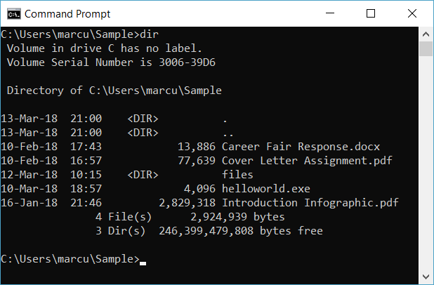

# How to Use the Command Prompt in Windows

 03/10/2018 •  5 minutes to read • Marcus Taylor Hallett

 

The Command Prompt, or Windows Command Processor, is a command-line interpreter (CLI) available in most editions of the Microsoft Windows operating system. It is used to execute commands issued by a user. It can be used to automate tasks by means of scripts and batch files and perform some advanced administrative functions.

This article will guide you through six common tasks using the Command Prompt.

### Requirements:
- Computer with Microsoft Windows 95 or later operating system

## Open the Command Prompt
Press  to open the Run dialog. Enter "cmd" in the Run dialog. Press "OK". The command prompt will now appear on your screen.

## List Contents of a Directory
Use the `dir` command to list the contents (such as files and subdirectories) of the current working directory. A listing of all files and subdirectories within the current working directory will be written to the Command Prompt.

> [!NOTE]
> Type the command and press  to execute a command.

## Change Working Directory
Use the `cd` command to change the working directory.

The `cd` command takes the following form: `cd <target directory>`

The working directory will then change to the target directory.

For example, enter `cd files` to enter a subdirectory called "files".

Use the `cd ..` command to go up one directory.

> [!TIP]
> You should surround the directory name with quotation marks if the name includes spaces.

## Create a Directory
Use the `md` command to make a new directory.

The `md` command takes the following form: `md <directory name>`

For example, enter `md recipes` to create a directory called "recipes".

## Remove a Directory
Use the `rd` command to remove a directory.

The `rd` command takes the following form: `rd <directory name`

> [!WARNING]
> A directory must be empty to be removed.

## Delete a File
Use the `rem` command to delete a file.

The `rem` command takes the following form: `rem <target file>`

## Run an Application or Execute Command

Enter the name of the desired application or command to execute the program or command.

For example, enter "helloworld.exe" or "helloworld" to execute program called "helloworld.exe". To execute the version command (to display the operating system version) enter `ver`.
	

